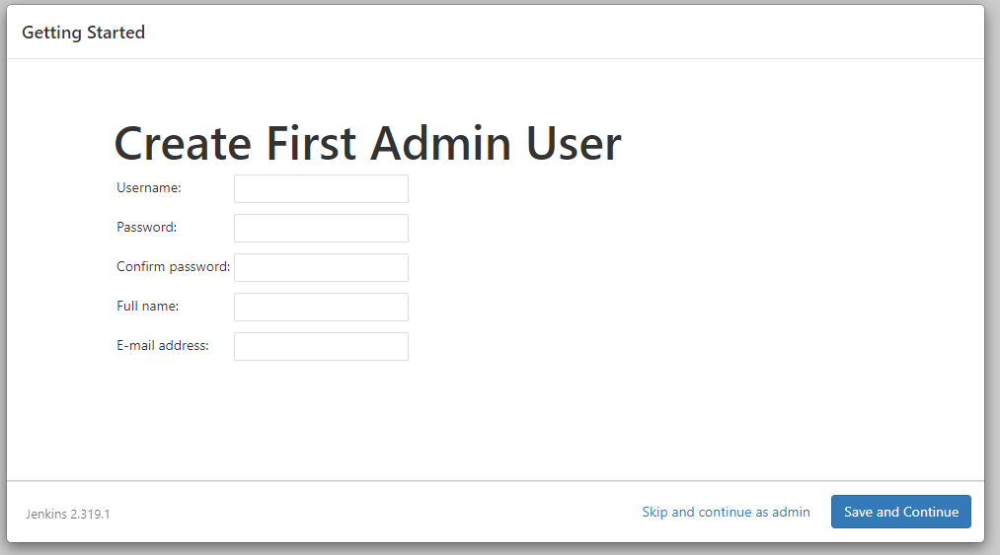

# Secure Code Management Homework

Preda Mihail Irinel, ISM

### Setup jenkins

##### Steps

1. Go to https://www.jenkins.io/download/ and download Download `Jenkins 2.319.1 LTS` for your OS system
2. Open Installer

|  |
| :--------------------------------: |
|            <b>Fig.1</b>            |

2. Choose where to install it:

|  |
| :-----------------------------------------------: |
|                   <b>Fig.2</b>                    |

3. Choose Logon type. Select `Run service as LocalSystem`

|  |
| :-------------------------------------: |
|              <b>Fig.3</b>               |

4. Select a port number or leave it as default (8080)

|  |
| :--------------------------------------: |
|               <b>Fig.4</b>               |

5. Test the port to see if it is available:

|  |
| :------------------------------------: |
|              <b>Fig.5</b>              |

6. Select where your Java JDK is installed:

|  |
| :-------------------------------------: |
|              <b>Fig.6</b>               |

7. Click next and don't change `Firewall Exception`

|  |
| :----------------------------------------: |
|                <b>Fig.7</b>                |

8. Install it

|  |
| :-----------------------------------: |
|             <b>Fig.8</b>              |

9. After install you need to unlock the Jenkins. Go to `http://localhost:{PORT_NUMBER}/` In my case is http://localhost:8080/

|  |
| :-------------------------------------------: |
|                 <b>Fig.9</b>                  |

10. You will see a window which will require from you an initial administrator passsword
    For default installation location of the password is `C:\Program Files (x86)\Jenkins\.jenkins\secrets\initialAdminPassword`,

|  |
| :--------------------------------------------: |
|                 <b>Fig.10</b>                  |

Copy and past it into the window dialog

|  |
| :---------------------------------------------------: |
|                     <b>Fig.11</b>                     |

11. After you enter the passsword you will have 2 options : `Install suggested plugins` or `Select plugins to install`

|  |
| :-------------------------------------------: |
|                 <b>Fig.12</b>                 |

12. After you have choosen, the plugin will start to install and you will see the progress.

|  |
| :-----------------------------------------------: |
|                   <b>Fig.13</b>                   |

13. After the plugins have been installed you need to create an admin

|  |
| :----------------------------------------: |
|               <b>Fig.14</b>                |

14. Set the URL address and press `Save and Finish`

|  |
| :--------------------------------------------------: |
|                    <b>Fig.15</b>                     |

15. Now Jenkins is ready

|  |
| :-------------------------------------------: |
|                 <b>Fig.16</b>                 |

---

### Homework 1

16. Go to https://github.com/ and login into your account
17. Create a new repository. Click on `new`

|  |
| :---------------------------------------: |
|               <b>Fig.17</b>               |

18. Choose a name and leave it as public. Press `Create Repository`

|  |
| :-----------------------------------------: |
|                <b>Fig.18</b>                |

19. Set the origin to your repo

|  |
| :--------------------------------------: |
|              <b>Fig.19</b>               |

20. Add a new Job :

|  |
| :---------------------------------------: |
|               <b>Fig.20</b>               |

21. Enter Job Name

|  |
| :-----------------------------------------: |
|                <b>Fig.21</b>                |

22. Enter a description. Go to `Source Code Management`, check `Git`, put the link to the repository and click `Save`

|  |
| :------------------------------------------: |
|                <b>Fig.22</b>                 |

23. If everyting is okey you will seein the workspace that the Jenkins successfully downloaded the files from Github.

|  |
| :-------------------------------------------------------: |
|                       <b>Fig.23</b>                       |

24. Then go to Configure ( 24GoToConfigure.png )

|  |
| :------------------------------------------: |
|                <b>Fig.24</b>                 |

25. Go to General and tick "This project is parameterized". After that you put the parameters that you have.
    (In my case I have 2 test suits, each one is run by specifying npm run testA or npm run testB ) ( 25Parametrized.png )

|  |
| :-----------------------------------------: |
|                <b>Fig.25</b>                |

26. Then go to build and add a Windows batch command and add the following line " npm install && npm run %whichTest% " ( 26WindowsBatch.png )

|  |
| :-----------------------------------------: |
|                <b>Fig.26</b>                |

27. Click on "Build with parameters" ( 27BuildWithParameters.png )

|  |
| :------------------------------------------------: |
|                   <b>Fig.27</b>                    |

28. Choose "testA", then press build. ( 28BuildTestA.png )

|  |
| :---------------------------------------: |
|               <b>Fig.28</b>               |

29. Click on the latest done build, go to "Console output" and see the results : ( 28BuildTestAConsoleOutput.png )

|  |
| :----------------------------------------------------: |
|                     <b>Fig.29</b>                      |

30. Click on "Build with parameters" ( 27BuildWithParameters.png )

|  |
| :------------------------------------------------: |
|                   <b>Fig.30</b>                    |

31. Choose "testB", then press build. ( 28BuildTestB.png )

|  |
| :---------------------------------------: |
|               <b>Fig.31</b>               |

32. Click on the latest done build, go to "Console output" and see the results : ( 28BuildTestBConsoleOutput.png )

|  |
| :----------------------------------------------------: |
|                     <b>Fig.32</b>                      |

### Homework 2

1. From dashboard, click on new Item ( 29newItem.png )

|  |
| :------------------------------------: |
|             <b>Fig.33</b>              |

2. Enter a name for the item, select Pipeline and press OK ( 30pipelineName.png )

|  |
| :-----------------------------------------: |
|                <b>Fig.34</b>                |

3. Add a description ( 31pipelineDescription.png )

|  |
| :------------------------------------------------: |
|                   <b>Fig.35</b>                    |

4. Scroll down to pipeline and Add a Pipeline script. To do this click on Pipeline Syntax ( 32pipelineScript.png )

|  |
| :-------------------------------------------: |
|                 <b>Fig.36</b>                 |

5. From select "Snippet Generator" from left handside, then in the main page at "Sample step" select "build: Build a job".
   After that, write the project to be build. Select with what parameter do you want the job and then click on "Generate Pipeline Script" ( 33PipelineSnippetGeneratorTestA.png, 34PipelineSnippetGeneratorTestB.png )

|  |
| :----------------------------------------------------------: |
|                        <b>Fig.37</b>                         |

6. Copy the generated codes into the Pipeline Script and press Save. ( 35PipelineScriptSaved.png )

|  |
| :------------------------------------------------: |
|                   <b>Fig.38</b>                    |

7. From left handside menu click on "Build Now" ( 36RunPipeline.png )

|  |
| :----------------------------------------: |
|               <b>Fig.39</b>                |

8. To see Pipeline result click on "#2" build ( 37SeePipelineResult.png )

|  |
| :----------------------------------------------: |
|                  <b>Fig.40</b>                   |

9. Then click on "Console Output" to see the build ( 38PipelineConsoleOutput.png )

|  |
| :--------------------------------------------------: |
|                    <b>Fig.41</b>                     |

---

Open a terminal in current directory and run `npm install`
For this homework to work you will need 2 terminals, in which you will run the following command:

-   Server Terminal
-   `node ./src/server.js`
-   Client Terminal
-   `node ./src/client.js`

---
